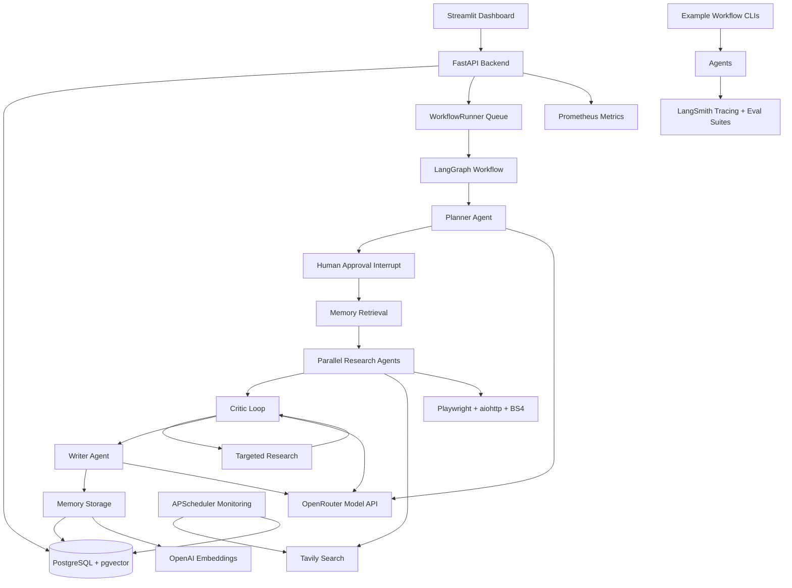

# Nexus

Nexus is an AI Operating System for knowledge work. It turns a user goal into a planned, researched, reviewed, cited, and stored knowledge artifact.

The project now includes six phases:

1. FastAPI and LangGraph foundation.
2. Human approval, web research, scraping, and parallel agents.
3. Persistent memory with pgvector and embeddings.
4. Critic reflection loop and structured cited reports.
5. Background execution, monitoring, token tracking, and dashboard observability.
6. Production example workflows, LangSmith eval suites, API hardening, load testing, CI, and demo readiness.

## Architecture



## Tech Stack

| Layer | Technology |
| --- | --- |
| API | FastAPI, async/await |
| Agent orchestration | LangGraph |
| LLM access | OpenRouter chat completions |
| Embeddings | OpenAI `text-embedding-3-small` |
| Database | PostgreSQL, asyncpg, pgvector |
| Checkpointing | LangGraph PostgresSaver |
| Research | Tavily, Playwright, aiohttp, BeautifulSoup, lxml |
| Memory | pgvector similarity search, Claude reranking |
| Scheduling | APScheduler AsyncIOScheduler |
| Observability | LangSmith, Prometheus client, token/cost tracker |
| UI | Streamlit multipage app |
| Testing | pytest, pytest-asyncio, pytest-mock |
| CI | GitHub Actions, ruff, mypy, pytest-cov |

## Prerequisites

- Python 3.11+
- Docker Desktop
- PostgreSQL available through Docker Compose
- OpenRouter API key
- OpenAI API key for embeddings
- Tavily API key for web search
- LangSmith API key for tracing and evals

## Installation

```powershell
python -m venv .venv
.venv\Scripts\activate
pip install -r requirements.txt
python -m playwright install chromium
```

Create `.env` from `.env.example`.

## Environment Variables

| Variable | Description |
| --- | --- |
| `OPENROUTER_API_KEY` | API key for OpenRouter model calls |
| `OPENROUTER_BASE_URL` | OpenRouter API base URL |
| `OPENROUTER_MODEL` | Model used by agents, default `anthropic/claude-sonnet-4` |
| `OPENROUTER_APP_NAME` | App title sent to OpenRouter |
| `OPENROUTER_SITE_URL` | Site URL sent to OpenRouter |
| `OPENAI_API_KEY` | API key for embeddings |
| `OPENAI_EMBEDDING_MODEL` | Embedding model, default `text-embedding-3-small` |
| `TAVILY_API_KEY` | Tavily API key for search and extraction fallback |
| `DATABASE_URL` | PostgreSQL connection URL |
| `LANGSMITH_API_KEY` | LangSmith tracing and evaluation key |
| `LANGSMITH_PROJECT` | LangSmith project name |
| `ENVIRONMENT` | Runtime environment, use `development` or `test` |
| `API_BASE_URL` | Frontend and scripts API base URL |
| `NEXUS_ALLOW_TIKTOKEN_DOWNLOAD` | Optional flag to allow tokenizer downloads |

## Running Locally

Start the full stack:

```powershell
docker compose up
```

Start services manually:

```powershell
docker compose up -d postgres
uvicorn backend.main:app --reload
streamlit run frontend/dashboard.py
```

Open:

| Service | URL |
| --- | --- |
| Backend | `http://localhost:8000` |
| Health | `http://localhost:8000/health` |
| Frontend | `http://localhost:8501` |
| Metrics | `http://localhost:8000/metrics` |

## Example Workflows

Market research:

```powershell
python -m workflows.market_research --company "Acme" --industry "SaaS" --geo "India"
```

Competitor analysis:

```powershell
python -m workflows.competitor_analysis --company "Us" --competitors "A,B,C"
```

Trend monitoring:

```powershell
python -m workflows.trend_monitor --topic "AI regulation" --keywords "EU AI Act,GDPR,LLM regulation"
```

## API Reference

| Method | Endpoint | Purpose |
| --- | --- | --- |
| `GET` | `/health` | Health check |
| `POST` | `/workflows` | Create a plan and pause for approval |
| `POST` | `/workflows/{run_id}/approve` | Resume approved workflow through the background queue |
| `POST` | `/workflows/{run_id}/reject` | Reject a pending workflow |
| `POST` | `/workflows/{run_id}/cancel` | Cancel a queued or running workflow |
| `GET` | `/workflows/{run_id}` | Get workflow status |
| `GET` | `/workflows/{run_id}/status` | Get workflow status and serialized state |
| `GET` | `/workflows/{run_id}/report` | Get final report JSON |
| `GET` | `/workflows/{run_id}/report.md` | Get final report markdown |
| `GET` | `/projects` | List projects |
| `POST` | `/projects` | Create project |
| `GET` | `/projects/{project_id}/runs` | List project workflow runs |
| `GET` | `/projects/{project_id}/memory` | Search project memory |
| `POST` | `/monitoring/jobs` | Create monitoring job |
| `GET` | `/monitoring/jobs` | List monitoring jobs |
| `DELETE` | `/monitoring/jobs/{job_id}` | Deactivate monitoring job |
| `GET` | `/monitoring/alerts` | List recent monitoring alerts |
| `GET` | `/monitoring/alerts/{job_id}` | List alerts for a job |
| `GET` | `/observability/runs/{run_id}/tokens` | Token and cost breakdown for a run |
| `GET` | `/observability/projects/{project_id}/cost` | Project cost summary |
| `GET` | `/observability/runs/{run_id}/trace` | LangSmith trace search URL |
| `GET` | `/observability/dashboard` | Dashboard aggregates |
| `GET` | `/metrics` | Prometheus metrics |

## Running Evaluations

Run all local evaluation suites:

```powershell
python -m evaluation.langsmith_evals --suite all
```

Run the registered LangSmith planner eval:

```powershell
python -m evaluation.langsmith_evals --suite langsmith
```

Datasets live in:

```text
evaluation/datasets/planner_dataset.json
evaluation/datasets/critic_dataset.json
```

## Load Testing

Run five concurrent workflows against a running backend:

```powershell
python scripts/load_test.py --base-url http://localhost:8000
```

The script reports time to first response, time to completion, p50/p95/p99 latency, tokens, cost, and failed runs.

## Project Structure

```text
backend/
  agents/
    base.py
    critic.py
    memory_agent.py
    planner.py
    research.py
    writer.py
  api/routes/
    monitoring.py
    observability.py
    projects.py
    workflows.py
  db/
    checkpointer.py
    connection.py
    migrations/
  graphs/
    research_graph.py
  memory/
    chunker.py
    embeddings.py
    store.py
  monitoring/
    scheduler.py
  observability/
    cost_estimator.py
    token_tracker.py
  schemas/
    api.py
    workflow.py
  tasks/
    background_runner.py
  tests/

frontend/
  app.py
  api_client.py
  dashboard.py
  pages/

workflows/
  market_research.py
  competitor_analysis.py
  trend_monitor.py
  common.py

evaluation/
  langsmith_evals.py
  datasets/

middleware/
  rate_limiter.py
  request_queue.py

scripts/
  load_test.py

docs/phases/
.github/workflows/ci.yml
docker-compose.yml
requirements.txt
pyproject.toml
```

## How To Add A New Agent

1. Create a schema in `backend/schemas/workflow.py` for the agent input or output.
2. Create `backend/agents/<agent_name>.py`.
3. Extend `BaseAgent` from `backend/agents/base.py`.
4. Add a specific system prompt.
5. Implement `async run(...)`.
6. Use Pydantic validation for structured model output.
7. Pass `run_id` into `_call_model()` when the agent runs inside a workflow.
8. Add a LangSmith `@traceable` decorator to public agent methods.
9. Add the agent node in `backend/graphs/research_graph.py` if it belongs in the main graph.
10. Add tests under `backend/tests/`.
11. Update this README and add or update the relevant phase document.

## CI

GitHub Actions runs:

- ruff lint
- mypy type checking
- pytest with coverage
- PostgreSQL service through Docker Compose
- LangSmith evaluation suite on merge to `main`

## License

This project is licensed under the terms in `LICENSE`.
